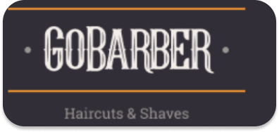

# **Gobarber**

I started this application for developing my skills in javaScript with some frameworks node Js, React & React Native. this application has the objective to help barbers to schedule appointments. 

## Backend

#### Dependencies
  * Bcryptjs
  * Express
  * Jsonwebtoken
  * Multer
  * Pg
  * Reflect-metadata
  * Typeorm
  * Uuidv4

## Frontend

## Mobile

